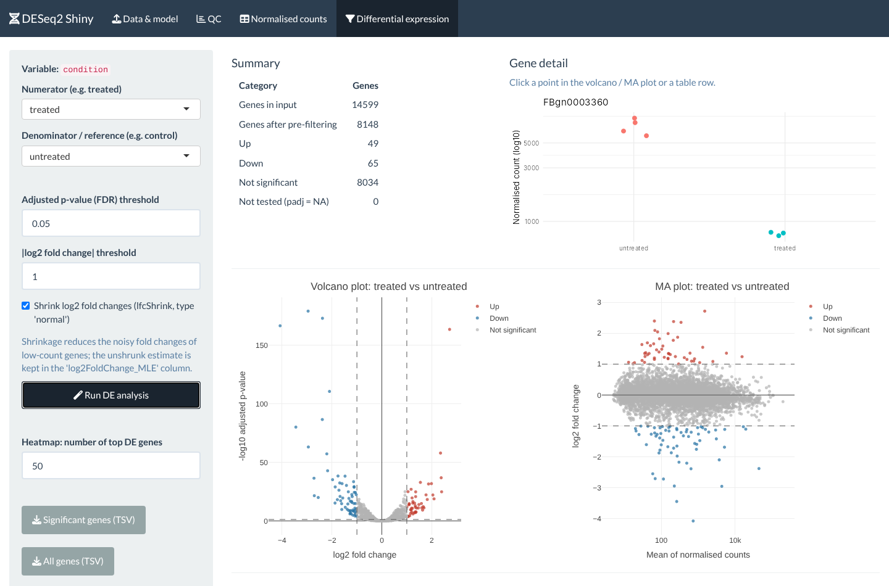
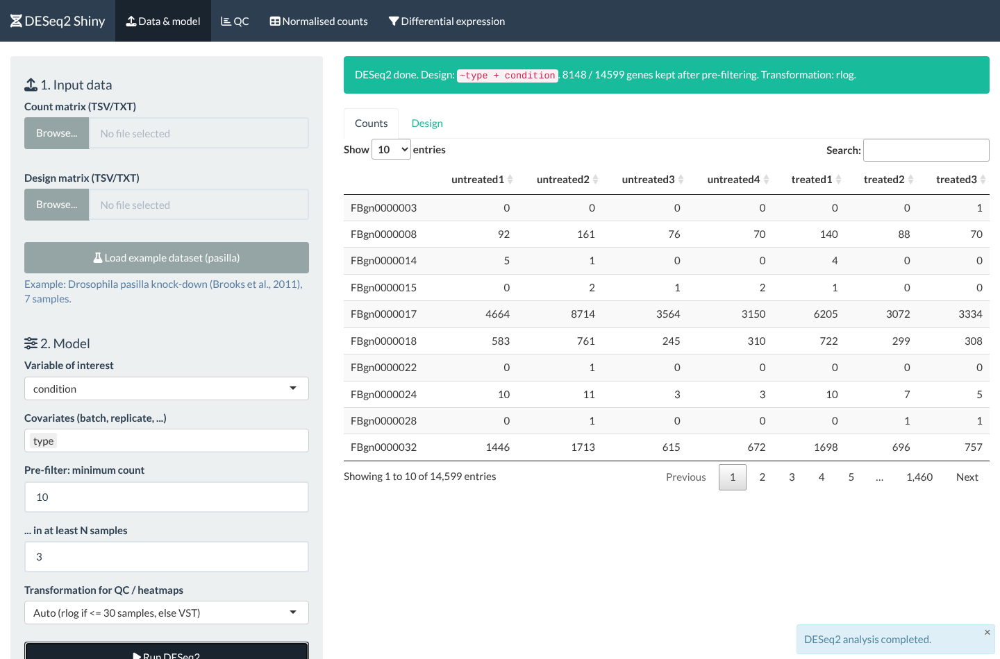
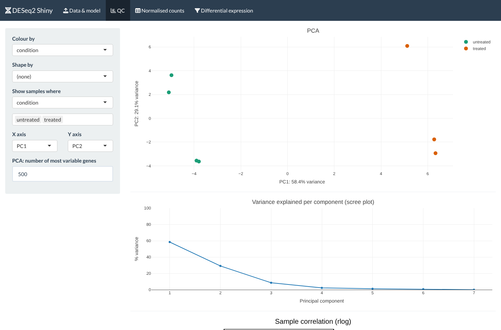
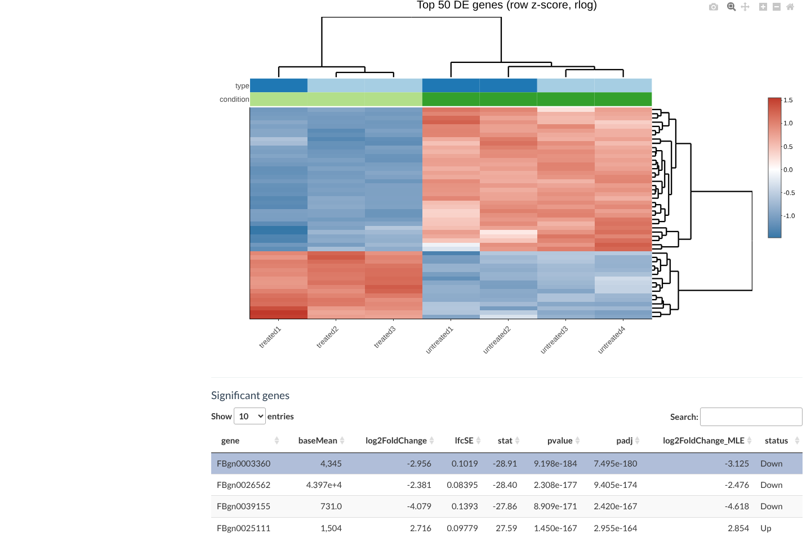

# DESeq2 Shiny

[](https://github.com/youcef-benmohammed/deseq2-shiny/actions/workflows/tests.yml)
[](LICENSE)
[](https://5lhxiz-youcef-ben0mohammed.shinyapps.io/deseq2-shiny/)

Interactive R Shiny application for bulk RNA-seq **differential expression analysis with
[DESeq2](https://bioconductor.org/packages/DESeq2/)**: upload a count matrix and a sample
sheet, choose the model, check sample quality, and explore, download and report the
differentially expressed genes, without writing code.

**▶ Live demo: https://5lhxiz-youcef-ben0mohammed.shinyapps.io/deseq2-shiny/**  
*Hosted on a free plan: the app sleeps when idle, so the first load can take 20–30 seconds. Then click **Load example dataset (pasilla)** → **Run DESeq2**.*



## Features

**Data & model**
- Upload a count matrix and a design matrix (TSV), or load the built-in **pasilla** example in one click
- Input validation with explicit messages: non-numeric / negative / missing values,
  duplicated or mismatching sample IDs (reported in both directions), non-integer counts
  (Salmon/RSEM estimates are rounded, with a warning)
- **Any design**: choose the variable of interest and optional covariates (batch, replicate, ...);
  the formula is built for you (`~ batch + condition`)
- Pre-filtering of low-count genes (minimum count in at least *N* samples)
- Variance-stabilising transformation for QC: rlog for <= 30 samples, VST above (or forced)

**Quality control**
- PCA on the 500 most variable genes (configurable), any pair of available components,
  colour / shape by any variable, sample filtering
- Scree plot and sample-to-sample correlation heatmap annotated with the design

**Differential expression**
- Any contrast (numerator vs reference) for the variable of interest
- Optional log2 fold-change shrinkage (`lfcShrink`, type `normal`); the unshrunk estimate is kept
- FDR and |log2FC| thresholds adjustable live, without re-running DESeq2
- Interactive volcano and MA plots: **click a gene** (or a table row) to see its normalised counts per group
- Raw p-value histogram (model diagnostic) and heatmap of the top DE genes (row z-scores)
- Summary table that also reports genes removed by pre-filtering and genes with `padj = NA`
- Downloads: significant genes, all genes, normalised counts (TSV) and a self-contained
  **HTML report** (parameters, QC, plots, top genes, `sessionInfo()`) for traceability

| Data & model | QC | Top DE genes |
|---|---|---|
|  |  |  |

## Quick start

### Option 1: conda

```bash
git clone https://github.com/youcef-benmohammed/deseq2-shiny.git
cd deseq2-shiny
conda env create -f environment.yml
conda activate deseq2-shiny
Rscript -e 'shiny::runApp(".", launch.browser = TRUE)'
```

### Option 2: Docker

```bash
docker build -t deseq2-shiny .
docker run --rm -p 3838:3838 deseq2-shiny
# then open http://localhost:3838
```

### Option 3: existing R installation (R >= 4.3)

```r
install.packages("BiocManager")
BiocManager::install(c("DESeq2", "shiny", "shinyjs", "shinythemes", "DT", "plotly",
                       "ggplot2", "heatmaply", "pheatmap", "rmarkdown"))
shiny::runApp("deseq2-shiny")
```

Then click **Load example dataset (pasilla)**, keep `condition` as variable of interest,
add `type` as covariate, click **Run DESeq2**, and go to **Differential expression**.

## Input formats

Both files are **tab-delimited**. Sample IDs must be identical in the two files (order does not matter).

**Count matrix**: raw (un-normalised) counts, genes in rows, samples in columns, first column = gene IDs.

```
gene_id      ctrl_1  ctrl_2  trt_1  trt_2
FBgn0000008      92     161    140     88
FBgn0000017    4664    8714   6205   3072
```

**Design matrix**: one row per sample, first column = sample IDs, any number of variable
columns with any names. The first level that appears in a column is used as the default
reference.

```
sample   condition  batch
ctrl_1   control    A
ctrl_2   control    B
trt_1    treated    A
trt_2    treated    B
```

Ready-to-use examples are in [`inst/extdata/`](inst/extdata/).

## Project structure

```
deseq2-shiny/
├── global.R               # packages and constants
├── ui.R / server.R        # app layout, wiring of the modules
├── R/
│   ├── helpers.R          # pure, unit-tested functions (I/O, validation, DESeq2 workflow)
│   ├── mod_data.R         # upload, validation, model choice, DESeq2 run
│   ├── mod_qc.R           # PCA, scree plot, correlation heatmap
│   ├── mod_norm.R         # normalised counts
│   └── mod_de.R           # contrast, plots, tables, downloads, report
├── report/report.Rmd      # HTML report template
├── inst/extdata/          # pasilla example dataset
├── tests/                 # testthat unit tests (run in CI)
├── environment.yml        # conda environment
└── Dockerfile
```

## Tests

```bash
Rscript tests/testthat.R
```

The tests cover input parsing and validation, formula construction, the full DESeq2
workflow on the example data (including a biological sanity check: *pasilla* itself is
detected as down-regulated), transformation choice, PCA and result classification.

## Statistical notes

- DESeq2 expects **raw counts**. For Salmon/kallisto/RSEM output, prefer
  `tximport` + `DESeqDataSetFromTximport` outside the app; rounded estimates are only an approximation.
- `padj = NA` genes are outliers (Cook's distance) or genes removed by DESeq2's independent
  filtering; they are kept in the "All genes" download and counted in the summary.
- Thresholding on |log2FC| after testing is a filter, not a test of |LFC| > threshold.

## Citation

Love MI, Huber W, Anders S. Moderated estimation of fold change and dispersion for RNA-seq
data with DESeq2. *Genome Biology* 15:550 (2014). doi:10.1186/s13059-014-0550-8

## License

MIT, see [LICENSE](LICENSE). The pasilla example data are distributed under LGPL
(see [`inst/extdata/README.md`](inst/extdata/README.md)).
